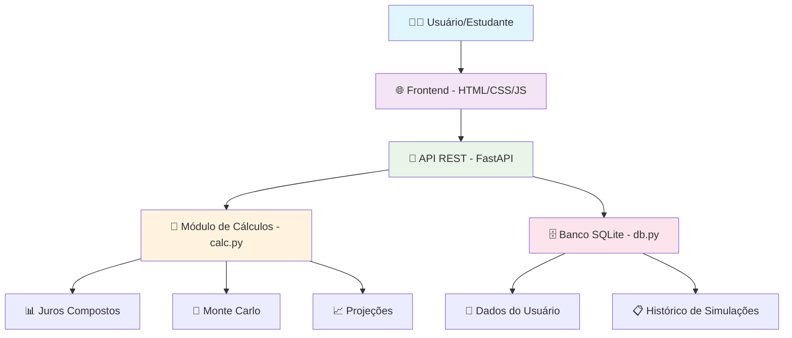

# Universidade Federal de Catalão (UFCat)
# Instituto de Matemática e Tecnologia (IMTec)
## LICENCIATURA PLENA EM MATEMÁTICA
### Práticas Extensionistas II 

# 💰 PLATAFORMA DE EDUCAÇÃO FINANCEIRA PARA ESTUDANTES : APLICADA AO 9º ANO DO ENSINO FUNDAMENTAL
### Autores: 
## Filipe Alves de Sousa; 
## Dauany Nitielly Andrade 
## Tatiane Coelho da Silva 
## Jania Ferreira de Menezes 


## 🎯 Visão Geral

Uma plataforma web interativa desenvolvida para ensinar **matemática financeira** e **planejamento financeiro** para alunos do 9º ano do ensino fundamental. O projeto combina **educação**, **tecnologia** e **gamificação** para tornar o aprendizado financeiro acessível e envolvente.

### 📊 Características Principais

- ✅ **Simulações Interativas** de investimentos
- 📈 **Comparações em tempo real** entre diferentes perfis de investimento  
- 🎲 **Simulação Monte Carlo** para ensinar sobre risco
- 🎯 **Calculadora de Metas** financeiras
- 📚 **Glossário** de termos financeiros
- 💡 **Dicas práticas** de educação financeira
- 💼 **Informações sobre profissões** e salários

---

## 🏗️ Arquitetura do Sistema



---

## 📁 Estrutura do Projeto

```
projeto_financeiro/
│
├── 📂 backend/                 # Servidor Python (API)
│   ├── 🐍 app.py              # Aplicação principal FastAPI
│   ├── 🧮 calc.py             # Cálculos financeiros
│   ├── 🗄️ db.py               # Operações de banco de dados
│   ├── 💾 data.db             # Banco SQLite (criado automaticamente)
│   ├── 🔧 models.py           # Modelos de dados (não usado atualmente)
│   └── 📋 requirements.txt     # Dependências Python
│
├── 📂 frontend/                # Interface do usuário
│   ├── 🌐 index.html          # Página principal
│   ├── 🎨 styles.css          # Estilos visuais
│   └── ⚡ app.js              # Lógica do frontend
│
├── 📖 README.md               # Este arquivo
└── 📖 README_COMPLETO.md      # Documentação detalhada
```

---

## 🔧 Tecnologias Utilizadas

### Backend (Servidor)
- **🐍 Python 3.13** - Linguagem de programação
- **⚡ FastAPI** - Framework web moderno e rápido
- **📊 Pydantic** - Validação de dados
- **🗄️ SQLite** - Banco de dados leve
- **🔄 CORS** - Comunicação entre frontend e backend

### Frontend (Interface)
- **🌐 HTML5** - Estrutura das páginas
- **🎨 CSS3** - Design responsivo e moderno
- **⚡ JavaScript** - Interatividade e comunicação com API
- **📊 Canvas API** - Gráficos simples

---

## 🚀 Como Executar o Projeto

### Pré-requisitos
- 🐍 Python 3.8+ instalado
- 🌐 Navegador web moderno
- 📝 Editor de código (recomendado: VS Code)

### Passo a Passo

1. **📥 Clone ou baixe o projeto**
   ```bash
   git clone https://github.com/seu-usuario/projeto-financeiro.git
   cd projeto-financeiro
   ```

2. **🐍 Instale as dependências Python**
   ```bash
   cd backend
   pip install fastapi uvicorn pydantic python-multipart
   ```

3. **🚀 Execute o servidor backend**
   ```bash
   python app.py
   ```
   O servidor estará rodando em: `http://localhost:8000`

4. **🌐 Abra o frontend**
   - Navegue até a pasta `frontend`
   - Abra o arquivo `index.html` no navegador
   - Ou use um servidor local como Live Server no VS Code

---

## 📸 Screenshots do Sistema

### 🖥️ Screenshot 1: Ambiente de Desenvolvimento no VS Code
*Captura da tela mostrando o VS Code com os arquivos do projeto abertos, terminal executando o backend e estrutura de pastas visível.*


### 🏠 Screenshot 2: Aba "Simulação" - Formulários Principais  
*Interface principal onde os alunos preenchem dados sobre sua realidade atual e planejam o futuro profissional com diferentes opções de investimento.*


### 🎯 Screenshot 3: Aba "Metas" - Calculadora de Objetivos
*Ferramenta interativa para calcular quanto tempo é necessário para atingir objetivos financeiros específicos, com exemplos de metas como notebook, curso superior, carro e casa.*


### 📚 Screenshot 4: Aba "Aprenda" - Conteúdo Educativo
*Seção educacional com glossário de termos financeiros explicados de forma simples e dicas práticas para o dia a dia dos estudantes.*


### 💼 Screenshot 5: Aba "Profissões" - Orientação Vocacional
*Informações sobre diferentes carreiras, faixas salariais esperadas e requisitos educacionais para ajudar na tomada de decisão profissional.*


---

## 🗂️ Detalhamento dos Arquivos

### 🐍 `backend/app.py` - Aplicação Principal
**Função:** Servidor web que processa requisições e calcula simulações financeiras.

**Principais recursos:**
- 🔐 **Validação de dados** com Pydantic
- 📊 **APIs para simulações** de investimento
- 🎲 **Simulação Monte Carlo** para mostrar variabilidade
- 📚 **Endpoints educativos** (glossário, dicas, profissões)
- 💾 **Persistência** de dados no SQLite

**Endpoints principais:**
- `POST /api/submit_reality` - Salva dados da realidade atual
- `POST /api/submit_future` - Calcula projeções de investimento  
- `GET /api/glossary` - Retorna glossário financeiro
- `GET /api/tips` - Dicas de educação financeira
- `POST /api/calculate_goal` - Calculadora de metas

### 🧮 `backend/calc.py` - Motor de Cálculos
**Função:** Implementa a matemática financeira por trás das simulações.

**Principais funções:**
- 📈 **`compound_monthly()`** - Juros compostos com aportes mensais
- 📊 **`project_investments()`** - Projeções de diferentes investimentos  
- 🎲 **`monte_carlo_projection()`** - Simulação probabilística de riscos

**Conceitos ensinados:**
- ✨ Poder dos juros compostos
- ⚖️ Relação risco x retorno
- 📅 Importância do tempo nos investimentos

### 🗄️ `backend/db.py` - Gerenciamento de Dados  
**Função:** Gerencia o banco SQLite para persistir dados dos usuários.

**Principais funções:**
- 🔧 **`init_db()`** - Inicializa tabelas do banco
- 💾 **`save_submission()`** - Salva formulários preenchidos
- 📋 **`get_submissions()`** - Recupera histórico de simulações

### 🌐 `frontend/index.html` - Interface Principal
**Função:** Estrutura visual da plataforma com navegação por abas.

**Principais seções:**
- 🎨 **Header animado** com estatísticas visuais
- 📋 **Formulários interativos** para coleta de dados
- 🔄 **Navegação por abas** para organizar conteúdo
- 📱 **Design responsivo** para diferentes dispositivos

### 🎨 `frontend/styles.css` - Design Visual
**Função:** Estilos modernos e responsivos para engajar jovens estudantes.

**Características do design:**
- 🌈 **Paleta de cores** atrativa e profissional
- ✨ **Animações sutis** para feedback visual
- 📱 **Responsividade** para mobile e desktop
- 🎯 **UX focada** em clareza e facilidade de uso

### ⚡ `frontend/app.js` - Lógica Interativa
**Função:** Conecta a interface com a API e processa respostas.

**Principais funcionalidades:**
- 🔄 **Comunicação com API** via fetch()
- 📊 **Renderização de resultados** das simulações
- 🎨 **Gráficos simples** com Canvas API
- ✅ **Validação de formulários** no lado cliente
- 🎯 **Feedback visual** para ações do usuário

---

## 🎓 Aspectos Educacionais

### 💡 Conceitos Financeiros Ensinados

1. **📈 Juros Compostos**
   - Como o dinheiro cresce exponencialmente
   - Importância de começar cedo
   - Diferença entre juros simples e compostos

2. **⚖️ Risco vs Retorno**  
   - Investimentos conservadores vs arriscados
   - Diversificação como estratégia
   - Volatilidade e incerteza

3. **🎯 Planejamento Financeiro**
   - Definição de metas SMART
   - Importância da disciplina
   - Orçamento pessoal

4. **💼 Orientação Profissional**
   - Relação educação x renda
   - Diferentes carreiras e salários
   - Planejamento de carreira

### 🎮 Elementos de Gamificação

- 🏆 **Metas visuais** com progresso claro
- 🎯 **Simulações interativas** com feedback imediato  
- 📊 **Comparações** que geram competição saudável
- ✨ **Animações** que recompensam ações corretas

---

## 🔮 Funcionalidades Futuras

### 📱 Versão Mobile
- App nativo para Android/iOS
- Notificações push para lembretes
- Modo offline para cálculos básicos

### 🎮 Gamificação Avançada  
- Sistema de pontos e badges
- Ranking entre turmas
- Desafios semanais

### 📊 Analytics Educacionais
- Dashboard para professores
- Relatórios de progresso
- Identificação de dificuldades

### 🤖 Inteligência Artificial
- Chatbot para dúvidas financeiras  
- Recomendações personalizadas
- Detecção de padrões de comportamento

---

## 🤝 Contribuição

Este projeto é **open source** e aceita contribuições! Algumas formas de ajudar:

1. 🐛 **Reportar bugs** via Issues
2. ✨ **Sugerir melhorias** educacionais
3. 🎨 **Melhorar design** e UX
4. 📖 **Expandir conteúdo** educativo
5. 🧪 **Adicionar testes** automatizados

### 📝 Como contribuir:
```bash
1. Fork do repositório
2. Crie uma branch: git checkout -b minha-feature
3. Commit suas mudanças: git commit -m 'Adiciona nova feature'
4. Push para a branch: git push origin minha-feature
5. Abra um Pull Request
```

---

## 📄 Licença

Este projeto está licenciado sob a **MIT License** - veja o arquivo [LICENSE](LICENSE) para detalhes.

---

## 👥 Equipe de Desenvolvimento

### 🎓 Contexto Acadêmico
- **Disciplina:** Práticas Extensionistas II
- **Curso:** Licenciatura em Matemática
- **Foco:** Educação financeira para o ensino fundamental

### 🎯 Objetivo Pedagógico
Promover **inclusão financeira** e **mobilidade econômica** por meio da educação, fornecendo aos jovens ferramentas práticas para tomada de decisões financeiras conscientes.

---

## 📞 Contato e Suporte

- 📧 **Email:** [meu_email@exemplo.com](mailto:meu-email@exemplo.com)
- 💻 **GitHub:** [@meu_github](https://github.com/filipe19)
- 🌐 **Demo Online:** [link-para-demo](https://github.com/filipe19)

---

## 🙏 Agradecimentos

- 🏫 **Instituição de Ensino** pelo apoio ao projeto
- 👨‍🏫 **Professor orientador** pelas diretrizes pedagógicas  
- 👥 **Colegas de turma** pelo feedback e sugestões
- 🧑‍💻 **Comunidade open source** pelas ferramentas utilizadas

---

**⭐ Se este projeto te ajudou, considere dar uma estrela no GitHub! ⭐**

---

*Desenvolvido com 💜 para transformar a educação financeira no Brasil* 🇧🇷
